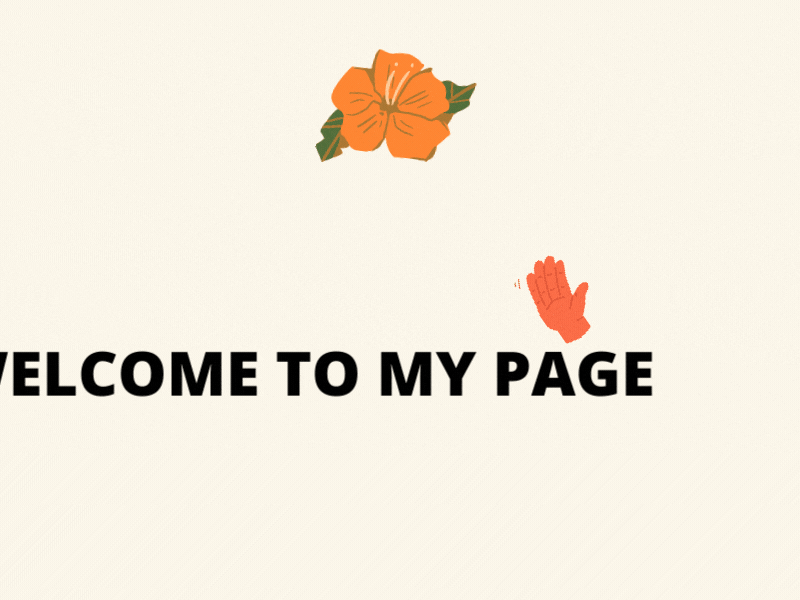

<!-- # Hallo! Welcome to my page! 👋 -->
</img>

My name is Titi. (pronounce Tee - Tee 😄). I am a trainee data scientist bootcamps from The Developer Academy with a Master's of Science in Project Management degree from the [University of Birmingham ](https://www.birmingham.ac.uk/index.aspx) and more than 4 years of project management experience. I love culinary and traveling. Curiosity has become my middle name! I am currently learning Machine Learning modelling to sharpen my programming and database skills.

😄 **Pronouns**: She/Her 
🌱 **Learning**: Currently learn Python include python library, SQL, Machine Learning. 
🤔 **Inspired by Confusius " 一千里的旅程必须开始与一个单一的一步"** leads me to decide to be data scientist. 
💡 **Fun fact**: I am a adventurous person, but </img> a.ka. Sleep on weekend is my most favorite moment 😆. 

## How to reach me 📫:

    
    
    

 

# Skills/Frameworks

# Projects
## Final Project 
### Prediction of electricity wholesale price | August 2022 | [Repo](https://github.com/upperAdd/final-project)
 
* This final project aims is to predict the electricity cost for the rest of 2022 until july 2023. To present the prediction, I use combination of Python Libraries and Machine Learning Supervised XGBoost.
 

## Machine Learning Mini Project
### Fake News detection | August 2022 | [Repo](https://github.com/upperAdd/Fake-News-)
 
* This project aims to detect fake news on published articles. To present the results, I use a combination of Python Libraries and Machine Learning random forest.
 

## Neural Network Project
### Churn Prediction | August 2022 | [Repo](https://github.com/upperAdd/Neural-Networks)
 
* This project aims to predict the customer bank that is doing churn. To present the prediction, I use a combination of Python Libraries and Machine Learning Unsupervised.
 
 
## Regression Project
### Linear Regression | July 2022 | [Repo](https://github.com/upperAdd/Linear-Regression-Assignment)
 
* For Flight Delay i'm using JFK Airport data to find the equation and use the simple linear regression to solved it. After several trial i believe for the data that i want to represent i dont need to use the Lasso and Ridge.
 

### Logistic Regression | July 2022 | [Repo](https://github.com/upperAdd/Logistic-Regression-Assignment)
 
* For this project i'm using the logistic regression and Naives bayes to predict the titanice passenger that survived.
 

## Data Analysis and Visualisation
### Data Visualization | June 2022 | [Repo](https://github.com/upperAdd/DV_assigment)
 
* This project aims to see the relationship between the most frequent locations with the damage that occurred. To present the data on graph, line and bar, I use a combination of Numpy, Pandas, Matplotlib, and Seaborn as Python Libraries.
 

## Mini Python
### Adventure Game | May 2022 | [Repo](https://github.com/upperAdd/Adventure-Game-DA_week-2)
 
* This project is my favourite one as this is my first project that i inspired by Alice in Wonderland that meet everyone on each stage/ book. for the green text colour is for me talk too for the white is naration text /sentence for the others colour is for anyone that i met too.
 

